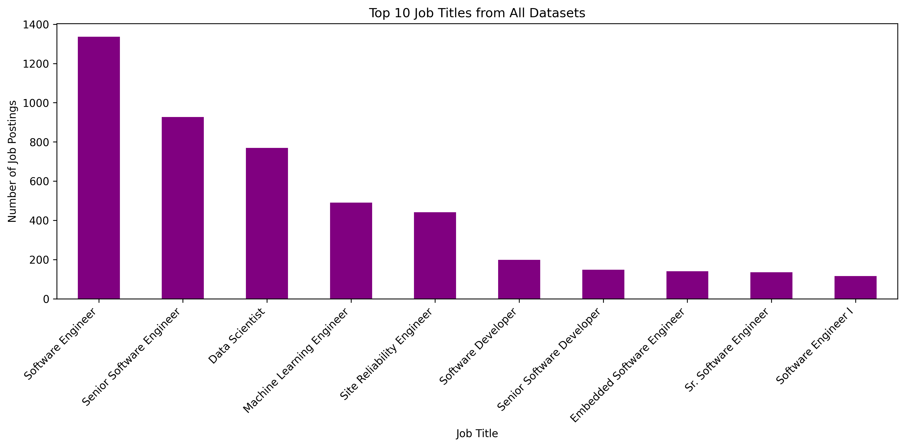
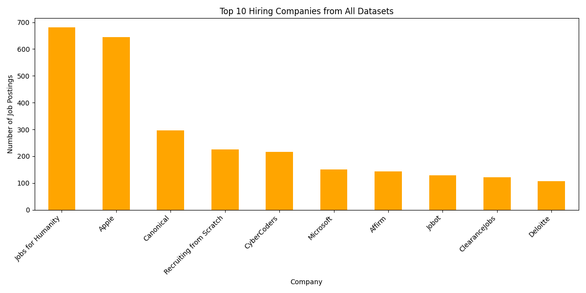
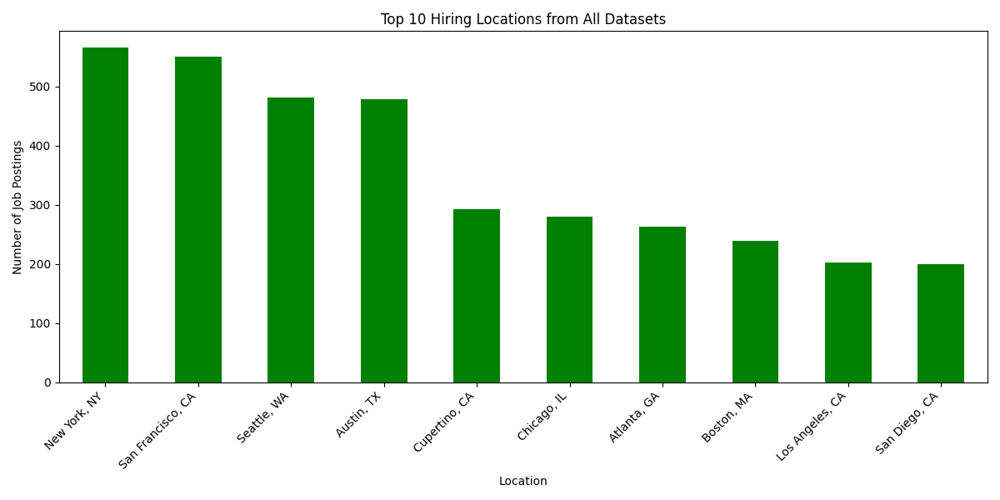
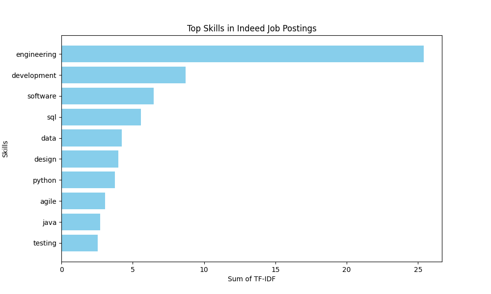
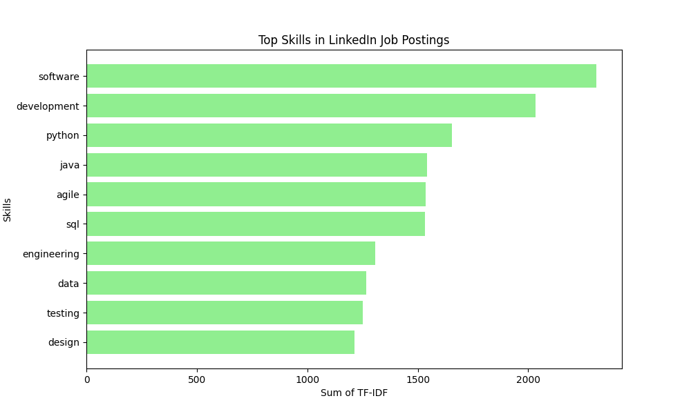
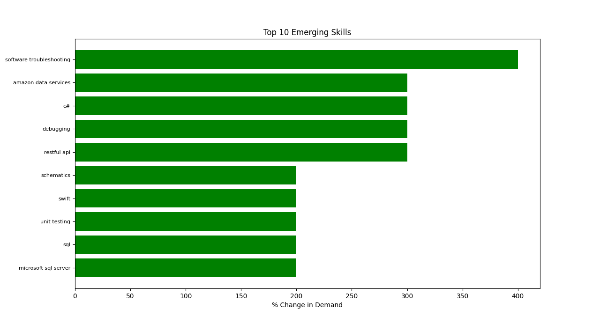
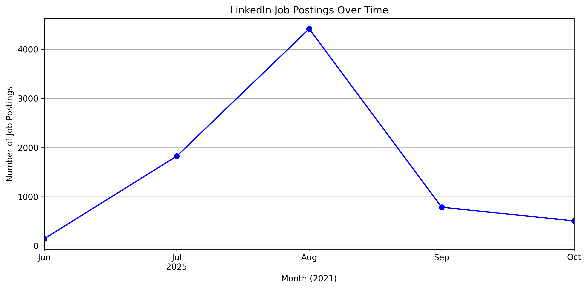
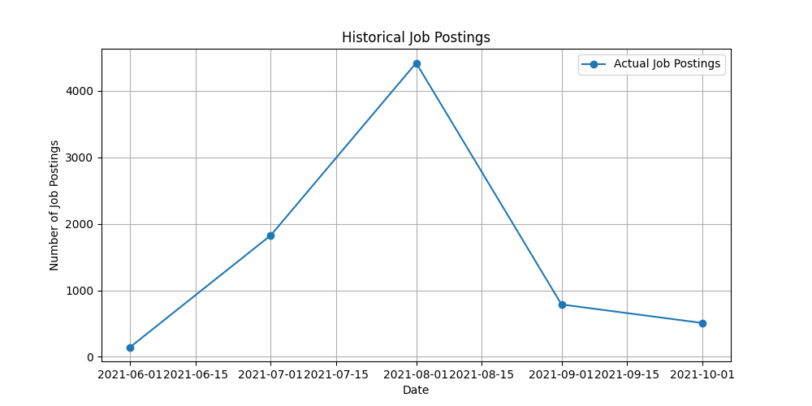
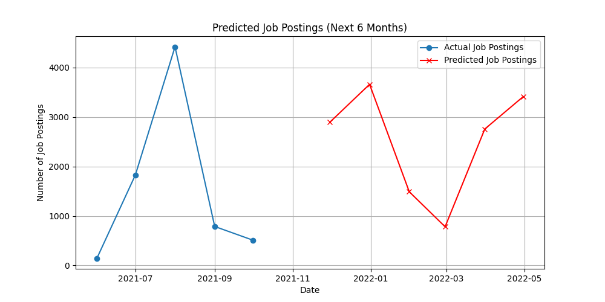
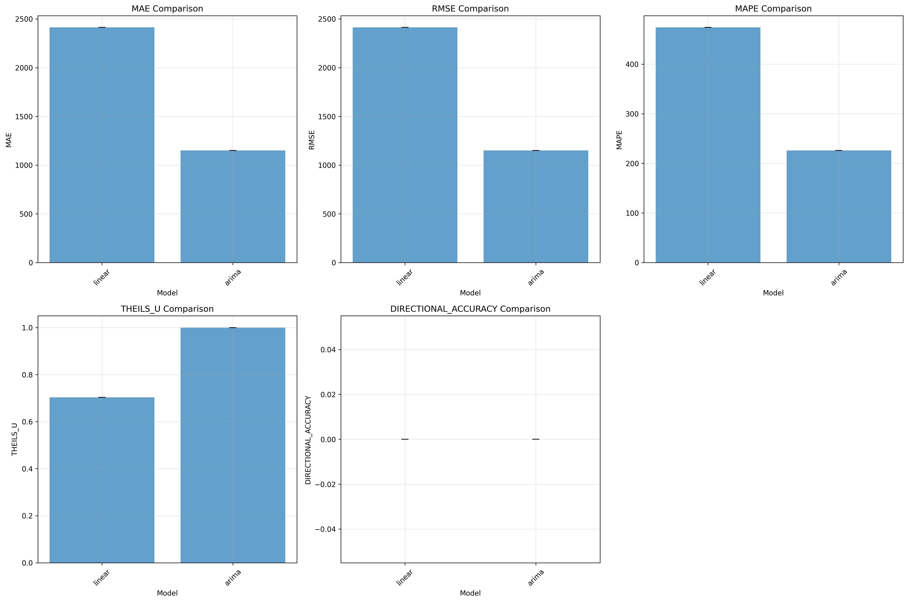

# Job Market Analysis

**What are employers actually asking for — and where is demand heading next?**

This project turns messy, web-scraped job postings from **Indeed** and **LinkedIn** into something you can read at a glance: skills that are rising, companies and cities that hire the most, how posting volume moves over time, and a short-horizon forecast of what comes next.

It started as a classic data-science sandbox — clean the scrapes, explore the market, then ask a model to peek a few months ahead. It grew into a small, portable pipeline with a Streamlit dashboard so you can run the whole story without hopping between notebooks.

---

## About the project

Job boards are noisy. Titles collide, skills are comma-salad, dates hide inside JSON blobs, and “United States” shows up as a location more often than you’d like. This repo is the cleanup crew **and** the analyst:

1. **Ingest** scraped CSVs into a single `dat_dir/`
2. **Clean** dates, skills, and duplicates into analysis-ready tables
3. **Explore** titles, companies, locations, and skill demand shifts
4. **Forecast** monthly posting volume with ARIMA (and stress-test that forecast)
5. **Present** everything in charts (`graph_dir/`) and tables (`output_dir/`), or through the dashboard

The guiding idea is simple: **one config for paths, one place for data, one place for graphs, one place for outputs** — so the project works on your laptop *and* on someone else’s without rewriting half the scripts.

> Educational / research-oriented. Scraped job-board data may be subject to site terms of use; treat datasets accordingly.

---

## What you can learn from it

| Question | How this repo answers it |
|----------|--------------------------|
| Which skills look “hot” vs historical LinkedIn? | TF-IDF on skills + demand-change charts |
| Who’s hiring the most? | Aggregated company counts across Indeed + LinkedIn |
| Where are the jobs? | Location tallies (with country-level noise filtered) |
| What titles dominate? | Cross-dataset job-title frequency |
| Is posting volume rising or fading? | Monthly time series from LinkedIn dates |
| What might the next few months look like? | ARIMA forecast + accuracy / model-comparison tests |

Optional PDFs under `docs/llm_validation/` capture side experiments validating themes with LLM assistants — nice context, not required to run the pipeline.

---

## Gallery — sample charts

These live in [`graph_dir/`](graph_dir/) and regenerate whenever you re-run the analysis scripts. They’re committed as examples so the repo looks alive even before you plug in the large LinkedIn CSVs.

### Market snapshot

<p align="center">
  
</p>

<p align="center"><em>Top job titles across Indeed + LinkedIn sources</em></p>

| Companies | Locations |
|:---------:|:---------:|
|  |  |
| *Who posts the most* | *Where the roles cluster* |

### Skills in demand

| Indeed (TF-IDF) | LinkedIn (TF-IDF) |
|:---------------:|:-----------------:|
|  |  |

<p align="center">
  
</p>

<p align="center"><em>Skills rising fastest when recent Indeed demand is compared with historical LinkedIn</em></p>

### Trends & forecast

<p align="center">
  
</p>

<p align="center"><em>Monthly LinkedIn posting volume</em></p>

| History | Next 6 months (ARIMA) |
|:-------:|:---------------------:|
|  |  |

<p align="center">
  
</p>

<p align="center"><em>Forecast bake-off metrics from <code>forecasting/</code> — how models stack up on error & directional accuracy</em></p>

> **Outputs vs graphs:** tabular results (forecast CSVs, skill-trend tables, accuracy summaries) land in `output_dir/` and are gitignored on purpose — regenerate them locally. The PNGs above are the “face” of the project on GitHub.

---

## Tech stack

| Layer | Tools | Why they’re here |
|-------|--------|------------------|
| Language | **Python 3.10+** | One language for cleaning, stats, plots, and UI |
| Data wrangling | **pandas**, **numpy** | CSV load/clean/aggregate without ceremony |
| Visualization | **matplotlib** | Static PNGs that drop straight into `graph_dir/` |
| Classical ML / NLP | **scikit-learn** | TF-IDF for skill importance; linear models in forecast tests |
| Time series | **statsmodels** | ARIMA (+ optional exponential smoothing in advanced tests) |
| Scientific extras | **scipy** | Stats helpers for advanced forecast evaluation |
| App UI | **Streamlit** | Local dashboard to run scripts and browse data/graphs/outputs |
| Config | **pathlib** via `config.py` | Machine-agnostic `DATA_DIR` / `GRAPH_DIR` / `OUTPUT_DIR` |

Pinned versions live in [`requirements.txt`](requirements.txt):

```text
pandas · numpy · matplotlib · streamlit · scikit-learn · statsmodels · scipy
```

No cloud services, no API keys, no database — clone, drop in CSVs, run.

---

## How the pipeline flows

```text
  dat_dir/*.csv
        │
        ▼
  cleaning scripts          (dates, skills, dedupe)
        │
        ├──────────────►  EDA scripts  ──────────►  graph_dir/*.png
        │                      │
        │                      └───────────────►  output_dir/*.csv
        │
        └──────────────►  ARIMA forecast
                               │
                               ├──────────────►  graph_dir/ (history + 6‑month view)
                               └──────────────►  output_dir/arima_job_postings.csv

  forecasting/  ── stress-tests the forecast (MAE, MAPE, model bake-offs)
  dashboard.py  ── runs scripts + previews data / graphs / outputs
```

Everything that needs a path goes through `config.py`. Scripts under `analysis/` and `forecasting/` bootstrap the repo root onto `sys.path`, so you can run them as plain files from the project root.

---

## Repository layout

```text
job-market-analysis/
├── analysis/                 # Cleaning, EDA, main ARIMA forecast
│   ├── clean_linkedin.py
│   ├── clean_skills_plot.py
│   ├── most_common_job_titles.py
│   ├── top_hiring_companies.py
│   ├── top_hiring_locations.py
│   ├── hiring_trends_overtime.py
│   ├── skill_demand_evolution.py
│   └── forecast_job_postings.py
├── forecasting/              # Accuracy tests & model comparison
│   ├── simple_forecast_test.py
│   ├── test_forecast_accuracy.py
│   ├── advanced_forecast_testing.py
│   └── run_forecast_tests.py
├── dat_dir/                  # Input (+ cleaned) CSVs  → see dat_dir/README.md
├── graph_dir/                # Generated charts (PNG)
├── output_dir/               # Generated result tables (CSV)
├── docs/llm_validation/      # Optional validation write-ups (PDF)
├── config.py                 # Single source of truth for folders
├── dashboard.py              # Streamlit control panel
├── requirements.txt
├── LICENSE
└── README.md
```

| Path | Role |
|------|------|
| `dat_dir/` | Source of truth for datasets |
| `graph_dir/` | Every plot scripts save |
| `output_dir/` | Every tabular result scripts save |
| `analysis/` | Day-to-day pipeline |
| `forecasting/` | “Is this forecast any good?” suite |
| `config.py` | Portable paths — no hardcoded machine folders |

---

## Features in more detail

### Cleaning
- **`clean_linkedin.py`** — Pulls `datePosted` out of nested JSON-ish content, drops nulls/dupes, writes `linkedin_no_skills_cleaned.csv`.
- **`clean_skills_plot.py`** — Tidies Indeed/LinkedIn skills, builds TF-IDF “top skills” charts, writes cleaned skill datasets.

### Exploratory analysis
- Most common **job titles** across all three sources  
- Top **hiring companies** and **locations** (countries filtered so cities can surface)  
- **Hiring trends over time** (monthly LinkedIn volume)  
- **Skill demand evolution** — historical LinkedIn vs recent Indeed, ranked by % change  

### Forecasting
- **`forecast_job_postings.py`** — Monthly series → ARIMA(2,1,2) → next **6 months**, plus historical & forecast plots  
- **`forecasting/`** — Cross-validation style checks, MAE/RMSE/MAPE/SMAPE, and multi-model comparison (ARIMA, linear regression, exponential smoothing when available)

### Dashboard
- Multiselect scripts and run them from the sidebar  
- Preview CSVs, browse `graph_dir/`, inspect `output_dir/`  

---

## Setup

```bash
git clone https://github.com/jackky04j/job-market-analysis.git
cd job-market-analysis

python -m venv .venv

# Windows
.venv\Scripts\activate

# macOS / Linux
source .venv/bin/activate

pip install -r requirements.txt
```

### Data you need

Drop CSVs into `dat_dir/`. Full file list and size notes: [`dat_dir/README.md`](dat_dir/README.md).

| File | In git? | Notes |
|------|---------|--------|
| `indeed_webscrape.csv` | Yes (small) | Indeed scrapes |
| `linkedin_historical.csv` | No (~40 MB) | Skills / historical LinkedIn |
| `linkedin_no_skills.csv` | No (~75 MB) | Titles + dates (JSON payload) |
| `linkedin_no_skills_cleaned.csv` | No (generated) | From `clean_linkedin.py` |

Large LinkedIn files are **gitignored** on purpose — clones stay light. Keep them locally, or share via Drive / a Release / Git LFS.

---

## Running it

### Dashboard (recommended)

```bash
streamlit run dashboard.py
```

Open the local URL Streamlit prints (usually `http://localhost:8501`). Use the sidebar to run analysis scripts; check **Graphs** and **Outputs** tabs for artifacts.

### Scripts from the terminal

Always run from the **repo root**:

```bash
# 1) Clean
python analysis/clean_linkedin.py
python analysis/clean_skills_plot.py

# 2) Explore
python analysis/most_common_job_titles.py
python analysis/top_hiring_companies.py
python analysis/top_hiring_locations.py
python analysis/hiring_trends_overtime.py
python analysis/skill_demand_evolution.py

# 3) Forecast
python analysis/forecast_job_postings.py

# 4) Evaluate forecasts
python forecasting/run_forecast_tests.py
```

### Suggested first-time pipeline

1. Place raw CSVs in `dat_dir/`  
2. Run the two cleaning scripts  
3. Run EDA + forecast (or drive it from the dashboard)  
4. Open `graph_dir/` and `output_dir/` — that’s your deliverable set  

---

## Design choices (worth knowing)

- **No hardcoded absolute paths** — `DATA_DIR / "file.csv"` everywhere  
- **Headless plotting** — scripts use the `Agg` backend, `savefig`, and `close` so they don’t freeze waiting for a GUI (important when the dashboard launches them)  
- **Outputs are disposable** — `output_dir/` contents are gitignored; regenerate anytime  
- **Example graphs can stay** in `graph_dir/` so the repo still looks alive before you re-run everything  

---

## License

MIT — see [LICENSE](LICENSE).

Built for learning the shape of a hiring market from real (messy) postings: clean bravely, plot clearly, forecast humbly.
